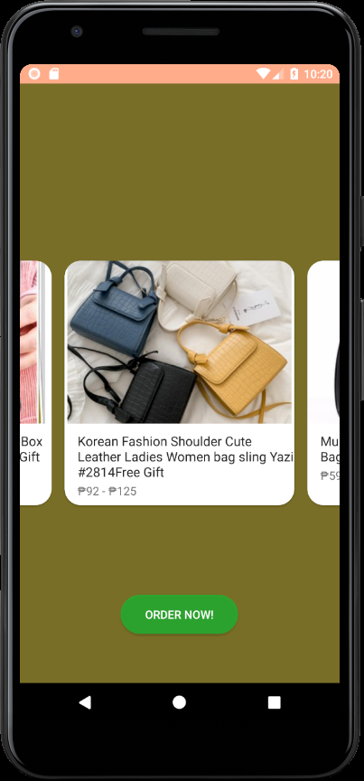
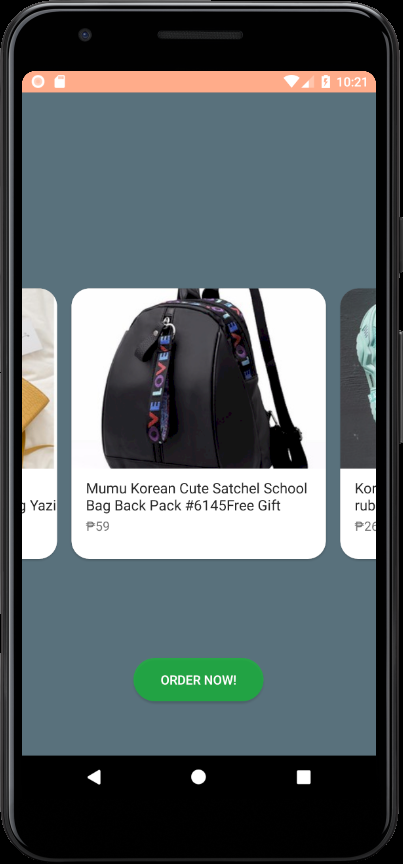

# GiftFinderApp
<!-- PROJECT LOGO -->
 

  

  <h3 align="center">GiftFinder</h3>

  

    Find Gifts for Special Occasions
     
    <a href="https://github.com/claudynetrixie/GiftFinderApp"><strong>Explore the docs »</strong></a>
     
     
  

<!-- TABLE OF CONTENTS -->

  
Table of Contents

  <ol>
    <li>
      <a href="#about-the-project">About The Project</a>
      <ul>
        <li><a href="#built-with">Built With</a></li>
      </ul>
    </li>
    <li>
      <a href="#setup">Setup</a>
    </li>
    <li>
      <a href="#screenshots">Screenshots</a>
    </li>
   
  </ol>

<!-- ABOUT THE PROJECT -->
## About The Project
GiftFinder aims to help users find gifts for their friends and loved ones for special occasions. GiftFinder is composed of an Android application written in Java and a serverless platform for processing and computation using Amazon Web Services (i.e. AWS API Gateway, Lambda).  The Android application serves as the front-end for users who would like to find customized gifts. On the other hand, web scraping in e-commerce sites is performed in the serverless platform using Selenium and BeautifulSoup to look for gifts suitable to the gift receiver.

### Built With
* Java
* XML
* Retrofit
* OkHttp
* Python
* Selenium
* BeautifulSoup
* Amazon Web Services (AWS)
  *  AWS Lambda for computation and processing
  *  AWS API Gateway for API handling

## Setup

First, clone the repo:

`git clone https://github.com/claudynetrixie/GiftFinderApp`

On Android Studio: 
* Open Android Studio and select `File->Open...` or from the Android Launcher select `Import project (Eclipse ADT, Gradle, etc.)` and navigate to the root directory of your project.
* Select the directory  and select the file `build.gradle` in the cloned repo.
* Click 'OK' to open the the project in Android Studio.
* A Gradle sync should start, but you can force a sync and build the 'app' module as needed.

Running the Sample App:
You can either connect an Android device to your development machine or use the Android Emulator.
* Select `Run -> Run 'app'` (or `Debug 'app'`) from the menu bar
* Select the device you wish to run the app on and click 'OK'

## Screenshots

### Homepage and Quiz:

### Results (Gift Recommendations):

